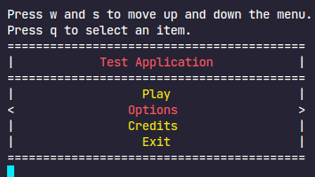

# Effortless console menu making software

This C++ program provides a simple way to create console menus. It allows you to define menu items and associate them with corresponding functions. The menu supports navigation using keyboard keys and selection using a designated key.

## Features

- Easy setup and usage
- Customizable menu appearance
- Keyboard navigation and selection
- Supports adding and removing menu items dynamically

## Installation

To use this menu software, include the `Menu.h` header file in your C++ project.

## Usage

1. Create an instance of the `Menu` class.
2. Set the desired options such as maximum string length, colors, and key bindings.
3. Add menu items using the `add_field` method, providing a name and associated function.
4. Call the `run_iteration` method to start the menu event loop.

## Notes
1. The head color and the body color have to be in the ANSI Color Coding to work.
2. The `run_iteration` function will keep running until and unless the user presses Exit.
3. There is a pre-defined field called `Exit` in the menu and it appears at the bottom of the menu.
4. The keybinds for the menu are stored in a string variable called `Keybinds`. The 0th index is the up key, 1st index is the down key, and the 2nd index is the select key.
5. The `printMenu()` and `gen_element()` functions are private as their only role is to make the menu printing easier.
6. You need to have the `conio.h` header in your project/compiler. Refer to [this link](https://raw.githubusercontent.com/ramadhinolfski/cpackets/master/conio.h) for the header file.

## Reference

### ANSI Color Codes

These following color codes will be suppored by the program as the head and body colors:

```ruby
+------------+------------+
| Color Code | Color Name |
+ ---------- + ---------- +
| 30         | Black      |
| 31         | Red        |
| 32         | Green      |
| 33         | Yellow     |
| 34         | Blue       |
| 35         | Magenta    |
| 36         | Cyan       |
| 37         | White      |
+------------+------------+
```

Values from 90 to 97 are the bright versions of values from 30 to 37

### Screenshots




## Example Usage

```c++
#include "Menu.h"

// Example usage
void option1() {
    // Handle option 1
}

void option2() {
    // Handle option 2
}

int main() {
    Menu menu;
    menu.add_field("Option 1", option1);
    menu.add_field("Option 2", option2);
    menu.run_iteration();

    return 0;
}
```
